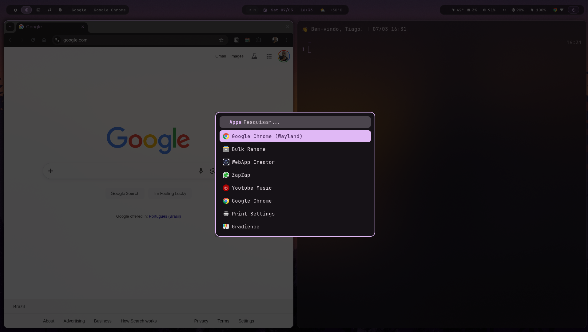
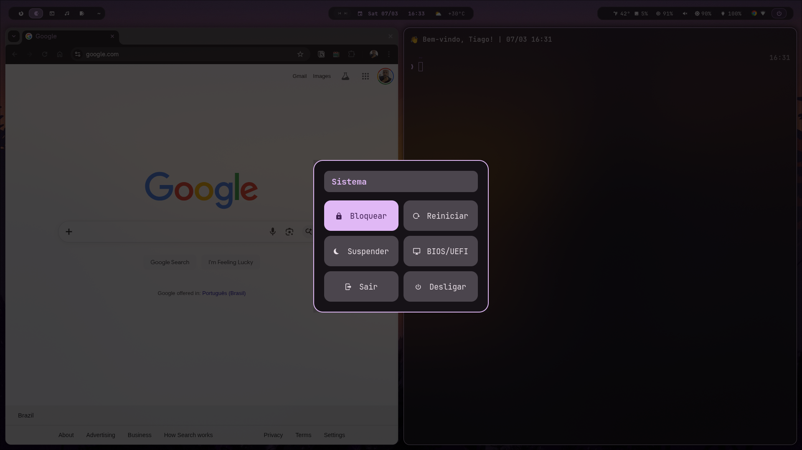
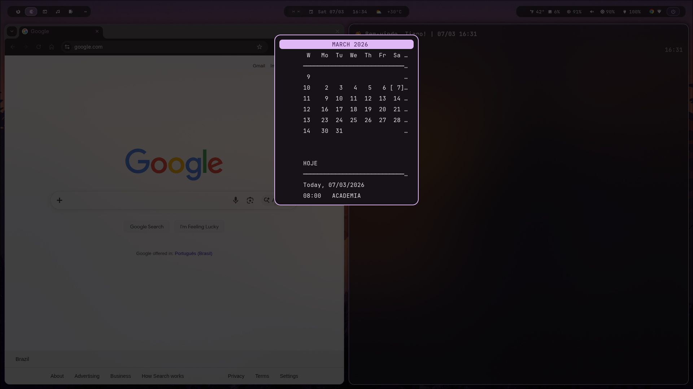
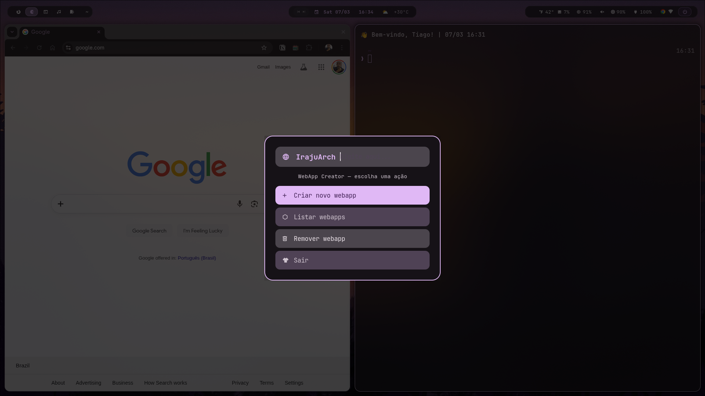
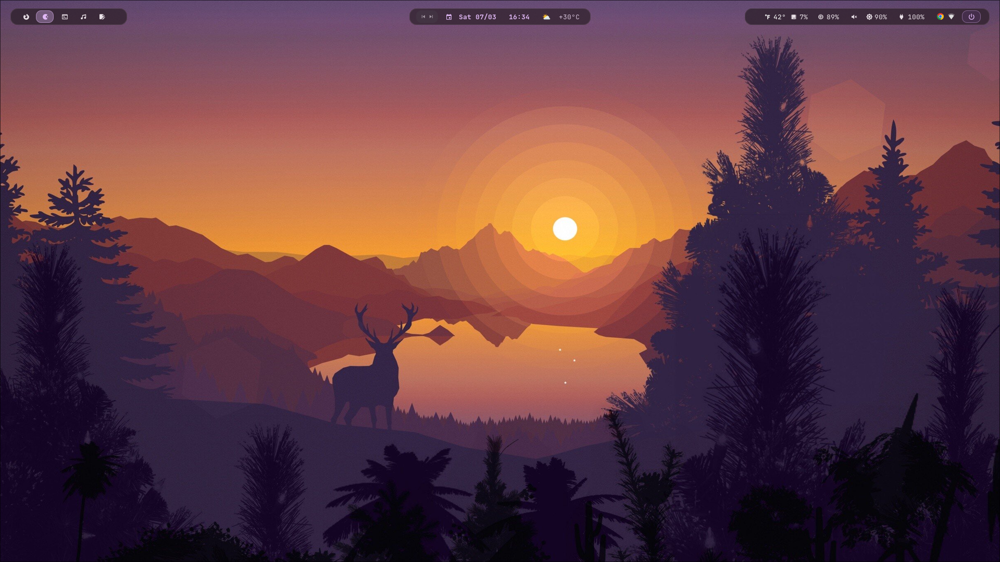

<div align="center">

# 󰣇 IrajuArch OS

**Arch Linux · Hyprland · Wayland**

*A clean, dynamic and modern desktop environment built for productivity and aesthetics.*

[](https://archlinux.org)
[](https://hyprland.org)
[](LICENSE)

</div>

---

## 📸 Screenshots

<div align="center">



<table>
  <tr>
    <td></td>
    <td></td>
  </tr>
  <tr>
    <td></td>
    <td></td>
  </tr>
</table>

</div>

---

## ✨ Destaques

- 🎨 **Cores dinâmicas** — o sistema inteiro muda de cor com o wallpaper via Matugen
- 🕐 **Wallpaper por horário** — troca automático às 6h, 12h, 18h e 22h
- 🎵 **Widget de música** — controles prev/play/next diretamente na barra
- 🌤 **Widget de clima** — temperatura do Rio de Janeiro em tempo real
- 📅 **Google Calendar integrado** — notificações de aulas 15min antes com link do Meet
- 💾 **Backup automático** — dotfiles sincronizados no GitHub todo dia
- 󰖟 **WebApp Creator** — cria webapps com ícone via interface Rofi
- ⚡ **Boot animado** — Plymouth com tema Arch

---

## 🧩 Componentes

| Componente | Descrição |
|---|---|
| **Hyprland** | Compositor Wayland com animações, blur e bordas dinâmicas |
| **Waybar** | Barra em 3 ilhas — workspaces · música+relógio+clima · hardware |
| **Kitty** | Terminal com transparência, JetBrainsMono e Fish shell |
| **Rofi** | Launcher, power menu, keybinds viewer e configs viewer |
| **Mako** | Notificações com glass effect e cores dinâmicas |
| **Neovim** | Editor com LazyVim, LSP para 5 linguagens e tema dinâmico |
| **Fish** | Shell com Starship prompt — ícone Arch, git status, horário |
| **Fastfetch** | System info com logo Arch e clima do Rio |
| **Matugen** | Gerador de paleta de cores a partir do wallpaper (Material You) |
| **swww** | Troca de wallpaper com animações suaves |
| **Scripts** | wallpaper-time, weather, dotfiles-backup, calendar, webapp |

---

## 🚀 Instalação

### Instalação completa (recomendado)

```bash
git clone https://github.com/proftiago/dotfiles.git ~/dotfiles
cd ~/dotfiles
bash install.sh
```

O `install.sh` é **interativo** com menu de 4 modos:

| Modo | Descrição |
|---|---|
| **Full Install** | Instala tudo do zero |
| **Minimal** | Só base + dotfiles + serviços |
| **Update** | Atualiza dotfiles e reinicia serviços |
| **Wallpapers** | Só baixa wallpapers do ML4W |

### Instalação manual (só dotfiles)

```bash
git clone https://github.com/proftiago/dotfiles.git ~/dotfiles
cd ~/dotfiles
stow hyprland waybar kitty rofi mako nvim fish scripts fastfetch
```

---

## 📁 Estrutura do Repositório

```
dotfiles/
├── hyprland/         # ~/.config/hypr/
├── waybar/           # ~/.config/waybar/
├── kitty/            # ~/.config/kitty/
├── rofi/             # ~/.config/rofi/
├── mako/             # ~/.config/mako/
├── nvim/             # ~/.config/nvim/
├── fish/             # ~/.config/fish/
├── fastfetch/        # ~/.config/fastfetch/
├── scripts/          # ~/scripts/
├── assets/           # Screenshots
├── install.sh        # Script de instalação interativo
└── README.md
```

---

## ⌨️ Atalhos principais

| Tecla | Ação |
|---|---|
| `SUPER + Enter` | Abre o terminal (Kitty) |
| `SUPER + Space` | Launcher (Rofi) |
| `SUPER + E` | Browser (Chrome) |
| `SUPER + A` | File manager (Yazi) |
| `SUPER + W` | Troca wallpaper aleatório |
| `SUPER + B` | Gerenciador Bluetooth |
| `SUPER + Q` | Fecha a janela |
| `SUPER + F` | Fullscreen |
| `SUPER + V` | Floating toggle |
| `SUPER + Escape` | Power menu |
| `SUPER + /` | Ver todos os keybinds |
| `SUPER + 1-5` | Muda de workspace |
| `Print` | Screenshot tela inteira |
| `SHIFT + Print` | Screenshot de área |
| `CTRL + Print` | Screenshot para clipboard |

---

## 📅 Pós-instalação

```bash
# 1. Google Calendar
vdirsyncer discover && vdirsyncer sync

# 2. GitHub CLI
gh auth login

# 3. Wallpapers por horário
mkdir -p ~/Wallpapers/{manha,tarde,noite,madrugada}

# 4. WebApp Creator
~/scripts/webapp.sh

# 5. Reinicie
reboot
```

---

<div align="center">

Feito com ♥ no Rio de Janeiro 🇧🇷

</div>
